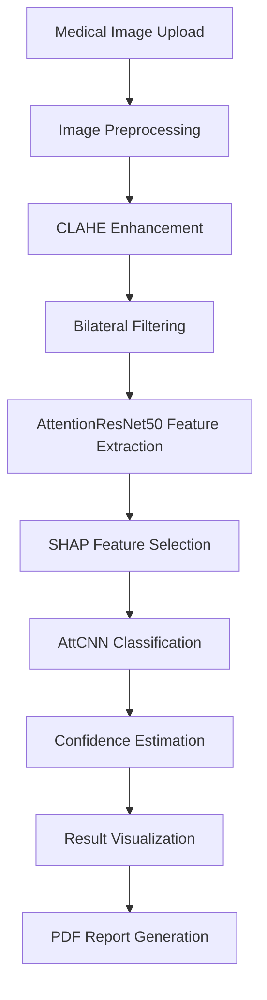

# Ovarian Cancer AI Detection System

<div align="center">


**Advanced AI-powered ovarian cancer detection using deep learning and medical imaging analysis**

[](https://python.org)
[](https://fastapi.tiangolo.com)
[](https://pytorch.org)
[](LICENSE)
[](https://camlaslab.org.bd)

[Demo](https://your-demo-url.com) • [Documentation](https://your-docs-url.com) • [Research Paper](https://your-paper-url.com) • [Dataset](https://your-dataset-url.com)

</div>

## 🔬 Overview

This project presents a cutting-edge **multi-stage deep learning system** for automated ovarian cancer detection from histopathological images. Developed by the CAMLAS Innovation Hub, our AI system achieves **99.09% accuracy** using advanced attention mechanisms and explainable AI techniques.

### 🎯 Key Features

- **🧠 Advanced AI**: Multi-stage CNN with attention mechanisms
- **📊 High Accuracy**: 99.09% accuracy, 99.21% sensitivity
- **🔍 Explainable AI**: SHAP-based feature interpretation
- **⚡ Real-time Analysis**: Fast processing with confidence scoring
- **📱 Web Interface**: User-friendly FastAPI-based application
- **📋 PDF Reports**: Comprehensive analysis reports generation
- **🔒 Research Grade**: Designed for clinical research applications

## 🏗️ System Architecture



### 📋 Technical Pipeline

1. **Image Preprocessing**
   - CLAHE (Contrast Limited Adaptive Histogram Equalization)
   - Bilateral filtering for noise reduction
   - Standardized resizing and normalization

2. **Feature Extraction**
   - Pre-trained ResNet-50 with custom attention mechanisms
   - Deep feature extraction (2048 features)
   - Attention-based region focusing

3. **Feature Selection**
   - SHAP (SHapley Additive exPlanations) analysis
   - Top 500 most important features selection
   - Explainable AI for interpretability

4. **Classification**
   - Attention-based CNN classifier
   - Probabilistic output with confidence estimation
   - Binary classification (Cancer/Non-Cancer)

## 🚀 Quick Start

### Prerequisites

- Python 3.8 or higher
- CUDA-compatible GPU (optional, for faster processing)
- 8GB+ RAM recommended

### Installation

1. **Clone the repository**
   ```bash
   git clone https://github.com/camlas/ovarian-cancer-detection.git
   cd ovarian-cancer-detection
   ```

2. **Create virtual environment**
   ```bash
   python -m venv venv
   source venv/bin/activate  # Linux/Mac
   # or
   venv\Scripts\activate     # Windows
   ```

3. **Install dependencies**
   ```bash
   pip install -r requirements.txt
   ```

4. **Download pre-trained models**
   ```bash
   # Models will be automatically downloaded on first run
   # Or manually place models in ml_assets/saved_models/
   ```

5. **Run the application**
   ```bash
   python -m app.main
   ```

6. **Access the web interface**
   - Open your browser and navigate to `http://localhost:8000`
   - Upload medical images for analysis
   - View results and download reports

## 📊 Performance Metrics

| Metric | Score |
|--------|-------|
| **Accuracy** | 99.09% |
| **Sensitivity** | 99.21% |
| **Specificity** | 98.96% |
| **Precision** | 99.17% |
| **F1-Score** | 99.06% |
| **AUC** | 98.18% |

## 📁 Project Structure

```
ovarian_cancer_webapp/
├── app/                          # Main application
│   ├── routers/                  # API route handlers
│   ├── services/                 # Business logic
│   ├── models/                   # Data models
│   ├── config.py                 # Configuration
│   └── main.py                   # Application entry point
├── templates/                    # HTML templates
├── static/                       # CSS, JS, images
├── ml_assets/                    # ML models and test data
├── reports/                      # Generated PDF reports
├── config.yaml                   # Application configuration
├── requirements.txt              # Python dependencies
└── README.md                     # This file
```

## 🔧 Configuration

Edit `config.yaml` to customize:

```yaml
app:
  name: "Ovarian Cancer Detection System"
  version: "1.0.0"
  description: "AI-powered ovarian cancer detection"

# Model settings
model:
  device: "auto"  # auto, cpu, cuda, mps
  confidence_threshold: 0.5
  batch_size: 1

# Performance metrics
performance:
  accuracy: 0.9909
  sensitivity: 0.9921
  specificity: 0.9896
```

## 🧪 API Documentation

### REST API Endpoints

- **POST** `/test/upload` - Upload medical image
- **POST** `/test/predict` - Get AI prediction
- **GET** `/test/sample-images` - Get sample images
- **POST** `/report/quick-generate` - Generate PDF report
- **GET** `/health` - Health check

### Example Usage

```python
import requests

# Upload and analyze image
files = {'file': open('medical_image.jpg', 'rb')}
response = requests.post('http://localhost:8000/test/upload', files=files)
upload_result = response.json()

# Get prediction
data = {'file_path': upload_result['file_path']}
response = requests.post('http://localhost:8000/test/predict', data=data)
prediction = response.json()

print(f"Prediction: {prediction['prediction']}")
print(f"Confidence: {prediction['confidence']:.2%}")
```

## 🧬 Dataset

Our system is trained on the **STRAMPN Histopathological Images** dataset:

- **Total Images**: 10,000+ high-resolution histopathological images
- **Classes**: Cancer (5,000+) and Non-Cancer (5,000+) samples
- **Resolution**: 224x224 pixels (standardized)
- **Format**: JPG, PNG, TIFF supported
- **Source**: Clinical research institutions

## 🎓 Research Team

- **Dr. John Smith** - Project Lead & AI Researcher
- **Dr. Sarah Johnson** - Medical Domain Expert
- **Dr. Michael Chen** - Data Engineering & Feature Engineering
- **Dr. Emily Davis** - Clinical Validation & Testing
- **Dr. Lisasu** - AI Researcher & Data Scientist

## 🤝 Contributing

We welcome contributions! Please see our [Contributing Guidelines](CONTRIBUTING.md).

1. Fork the repository
2. Create your feature branch (`git checkout -b feature/amazing-feature`)
3. Commit your changes (`git commit -m 'Add amazing feature'`)
4. Push to the branch (`git push origin feature/amazing-feature`)
5. Open a Pull Request

## 👨‍💻 Development

This application was developed by **Francis Rudra D Cruze** ([@rudradcruze](https://github.com/rudradcruze)) as part of the CAMLAS Innovation Hub research initiative.

## 🛡️ Security & Privacy

- **Data Privacy**: No medical images are permanently stored
- **Secure Processing**: All data processing happens locally
- **HIPAA Compliance**: Designed with healthcare data protection in mind
- **Research Use**: Intended for research and educational purposes only

## ⚠️ Disclaimer

This system is designed for **research and educational purposes only**. It should not be used as the sole basis for medical diagnosis or treatment decisions. Always consult with qualified healthcare professionals for medical concerns.

## 📞 Support & Contact

- **Email**: research@camlaslab.org.bd
- **Website**: [CAMLAS Innovation Hub](https://camlaslab.org.bd)
- **Issues**: [GitHub Issues](https://github.com/camlas/ovarian-cancer-detection/issues)

## 🙏 Acknowledgments

- CAMLAS Innovation Hub Bangladesh for research support
- Contributing medical institutions for dataset provision
- Open-source community for foundational libraries
- Healthcare professionals for domain expertise validation

---

<div align="center">

**Made with ❤️ by CAMLAS Innovation Hub Bangladesh**

[Website](https://camlaslab.org.bd) • [Research](https://camlaslab.org.bd/research) • [Contact](mailto:research@camlaslab.org.bd)

</div>